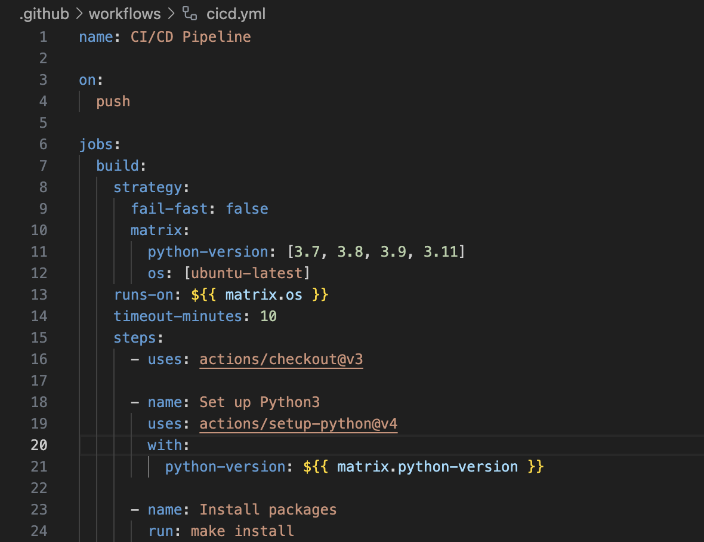

# Mini_Project_4

This is the README for my Mini Project 4 for the IDS706 - Data Engineering Systems class at Duke University.

## Core Requirement: GitHub Actions Matrix Build for Multiple Python Versions

To fulfill one of the core requirements, I set up a GitHub Actions workflow where I tested the build strategy out on 4 different Python3 versions ranging including 3.7, 3.8, 3.9, and 3.11 on the CI/CD pipeline. This project is built on top of my [Mini Project 3](https://github.com/nogibjj/Peter_Min_Data_Engineering_Project3).

## Dataset
The dataset comes from Kaggle, a public machine learning and data science community. It contains a CSV file of detailed information regarding the most-streamed Spotify songs in 2023. Link: https://www.kaggle.com/datasets/nelgiriyewithana/top-spotify-songs-2023/data

## Techniques Applied
In addition to [Pandas](https://pandas.pydata.org/) for convenience with drawing figures, I have integrated [Polars](https://pola.rs) for more convenience in data preparation. Compared to Pandas, Polars is faster and more expressive in terms of mimicking the behaviors of data wranling syntax.

## Data Visualization
For the visualization, I analyzed and visualized the 10 hottest artists by their stream counts.

## Summary Statistics
Here is a glimpse into the summary statistics for certain columns from the dataset by running `dataframe.describe()`:

